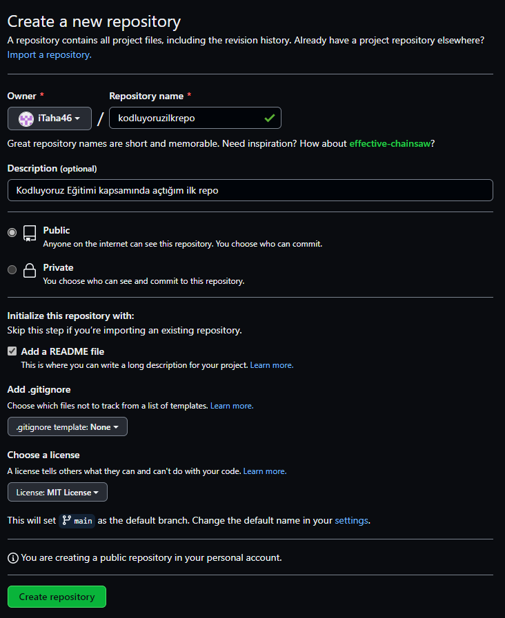

# Kodluyoruz İlk Repo

Bu repo [Kodluyoruz](https://www.kodluyoruz.org) Front-End Eğitiminde oluşturduğumuz ilk repo. İçerisinde bir adet README dosyası, bir adet de index.html barındırıyor.



## Installation
---

```bash
git clone https://github.com/iTaha46/kodluyoruzilkrepo.git
```

## Usage
---
Linux için:
```linux
cd kodluyoruzilkrepo
code .  
```

## Contributing
---

## License
---
[MIT](https://choosealicense.com/licenses/mit/)
